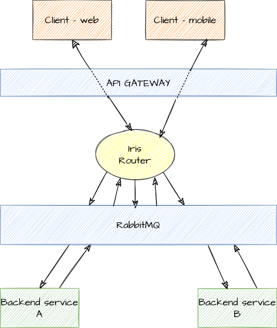
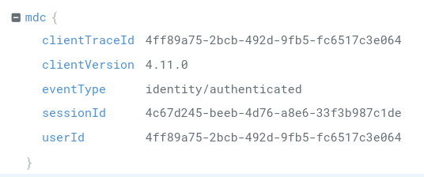

= Developer integration guide - websocket client

The following guide will provide you with all required information to start using our event driven architecture (Iris) within client (web and mobile) through WebSocket connection.

:toc:

Related: link:./developer-integration-guide-client/web-socket-best-practices.md[Web Socket client integration best practices]

== Infrastructure

The main infrastructure consists of clients, API gateway, Iris Router, RabbitMQ broker and backend services as pictured below.

== Establishing WebSocket connection

Protocol: `WSS` - Web Socket Secure

URI: `api.globalid{.env}/v0/websocket`

Example for our development environment: `wss://api.globalid.dev/v0/websocket`

== Session id

As a response to opening a websocket client will be returned a response with HTTP Status code 101 (Switching Protocols). The response headers will among other contain session id.

Header name: `x-iris-session-id`

Format: `UUID`

All logs within backend will be equipped with this session id as part of Mapped Diagnostic Context (MDC) under property `mdc.sessionId`. See https://global-id.atlassian.net/wiki/spaces/GiD/pages/2607185937/Developer+integration+guide+client#MDC-equipped-log-example%3A[MDC equipped log example]

== Authorizing the subscription

In order to authorize the client a valid JWT (Json Web Token) token must be passed within `subscribe` event:

Event: `subscribe`

Payload:

[source,json]
----
{"token": "json-web-token"}

----

Example:
[source,json]
----
{
  "event": "subscribe",
  "payload": {
    "token": "8Ha8k-C-eFY8DA6nzjX64bRgZTJXfXMR_SuWiHwzYXw.0nesTv1AxwqfnQ1gXlFvJatEN1AoIv8jMETd4Sr-L2I",
    "resources": []
  },
  "client_trace_id": "<uuidV4>"
}

----

If subscription succeeded the WebSocket session is now authorized and all further messages from router onwards will now contain JWT header.

Client can optionally add a list of resources to which he wants to subscribe.

== Message detail

Client message is build out of the three main properties: `event`, `payload` and optionally `clientTraceId` and is represented in JSON format.

== Event

Property: `event`

Type: string

Specifies unique event type based on which the Iris Router (router in the following) will route it to correct backend service. All possible events are described in always growing client asyncapi document (**TODO: add link to asyncapi doc, once published**).

=== Payload

Property: `payload`

Type: JSON object

Payload is also a JSON object which is described in asyncapi client document for each event separately.

=== Client trace id

Property: `client_trace_id` (usually uuid)

Type: string

Client can specify trace id and all messages sent back to client which were triggered as a cause of this message will contain that same client trace id.

There could be *none*, *one* or *several* messages which can be sent to client containing that id.

Typical example would be when client expects a message triggered as a consequence of his mesasge sent. Typically “wizard” patterns when previous action must be acknowledged by third party through backend in order to proceed to the next screen. To resolve this, client will attach `client_trace_id` to the message and block “wizard” from going to next screen until the message with the same `client_trace_id` and positive resolution is consumed. If no message arrives in timely manner, the client should retry, or present and error to the user.

All logs within backend will be equipped with this session id as part of Mapped Diagnostic Context (MDC) under property `mdc.clientTraceId`.

==== MDC equipped log example:

== Handling idempotency

All messages should be idempotent. Idempotency can be achieved on the message payload with the target backend service. If this is not sufficient, we can provide additional logic which can be hooked to client trace id. *TODO: discuss*

== Handling race conditions and time sensitive messages

=== Race conditions

In event driven architecture the order of events/messages should never matter. Therefore no timestamp is provided by the infrastructure itself, cause infrastructure only provides communication media, not the content aware logic.

Every participating actor (be it client or backend) must react on messages as they arrive. If some state depends on multiple events the state is not complete until all events are “collected”. However the last most event is considered to be “up to date” for the client.

==== Corner cases

The infrastructure cannot ensure, that messages `A` and `B` emitted from the client in order `A`, `B` will arrive to the backend in that order. Therefore, backend must work with that in mind -&gt; collect `B`, update state, collect `A`, update state -&gt; emit message to client.

If client absolutely needs message `A`, to be processed before message `B` the backend must emit message (response) when `A` is processed in order for client to get the confirmation and only than send message `B` from the client.

=== Time sensitive messages and eventual consistency

==== Chat

When client must present some information in time order, the payload itself (provided by backend service) must contain timestamp.

If we take chat messages for example, the timestamp must be part of the message payload. This means, that client must order content (chat messages in this case) based on timestamps within event `payload`. This can be often observed on Facebook messenger or Slack with unstable connection, when messages appear at different times and are ordered additionally.

[source,json]
----
{
  "event": "direct-message",
  "payload": {
    "timestamp": 1645112855000,
    "sender": "John",
    "content": "Hello, my name is John!"
  }
}

----

==== State

In case when client is holding some state of an object it can assume, that latest received event is “up to date”. Even if it’s not, the state will eventually become consistent through one of the following scenarios:

* future events

* client requesting it specifically due to error (either on client or backend side)

== Error messages

Backend can return error message with correlation id of the client message which caused an exceptional situation.

Error message is sent back to client when client can take advantage of it or is expecting a message as a reaction to emitting client message. However error message details are to be agreed between backend service developers and client side developers. Initial structure is provided in order to follow some guidelines.

=== Message structure

* `error_type` (infrastructure predefined values)

* `code` (infrastructure and service specific predefined values)

* `message` (case specific values)

=== Error types

* `FORBIDDEN` (SecurityError)

* `UNAUTHORIZED` (SecurityError)

* `BAD_PAYLOAD` (ClientError)

* `NOT_FOUND` (ClientError)

* `INTERNAL_SERVER_ERROR` (ServerError)

All error messages from the backend should be of one of those types. If we find requirement appears, we can add additional.

* `UNAUTHORIZED` error type is returned for all auth related issues (client codes: `UNAUTHORIZED`, `AUTHENTICATION_FAILED`, `TOKEN_EXPIRED` )

* `FORBIDDEN` error type is returned when user is authenticated, but is missing required roles to access/send specific  resource/message

=== Reserved codes

|===
|*errorType* |*code* |*message* 

|`FORBIDDEN` |`FORBIDDEN` |_Case specific_ 
|`UNAUTHORIZED` |`UNAUTHORIZED` |_Case specific_ 
|`UNAUTHORIZED` |`AUTHENTICATION_FAILED` |_Case specific_ 
|`UNAUTHORIZED` |`TOKEN_EXPIRED` |_Case specific_ 
|`BAD_PAYLOAD` |`BAD_PAYLOAD` |_Case specific_ 
|`NOT_FOUND` |`NOT_FOUND` |_Case specific_ 
|`INTERNAL_SERVER_ERROR` |`INTERNAL_SERVER_ERROR` |_Case specific_ 
|===

== Demo playground

On our dev cluster we have iris demo web shop deployed with which you can play around and test different scenarios. See the details here: https://global-id.atlassian.net/wiki/spaces/AR/pages/2556755994/Developer+integration+guide+Java#Web-shop

== Subscriptions

In order to support subscriptions the *subscription service* will be introduced.

Service will hold a state of currently active subscriptions in memory with the following information:

* `resourceType`

* `resourceId`

* list of sessions for each resource type and id

Resource type and resource id will provide unique identifier for subscription and hold a list of subscribed sessions.

See the following examples:

* messaging channel subscription +
`resourceType` = `&quot;group&quot;` +
`resourceId` = `&lt;channelId&gt;`

* consent subscription +
`resourceType` = `&quot;consent&quot;` +
`resourceId` = `&lt;consentId&gt;`

* user updates subscription +
`resourceType` = `&quot;user&quot;` +
`resourceId` = `&lt;userId&gt;`

* transaction updates subscription +
`resourceType` = `&quot;transaction&quot;` +
`resourceId` = `&lt;transactionId&gt;`

This information will be provided by user (or backend service) when user will subscribe to some resource updates.

== Subscription message

Client can be subscribed to a resource updates through backend (auto-subscription) or manually by sending a message.

=== Manual (client) subscription

In order to manually subscribe to the resource client will send `subscribe` event to the backend in the following format:

*client → backend*

[source,json]
----
{
  "event": "subscribe",
  "client_trace_id": "optionally-some-unique-id",
  "payload": {
    "resources": [
      {
        "resourceType": "<resource-type",
        "resourceId": "<resource-id>"
      },
      {
        "resourceType": "<resource-type",
        "resourceId": "<resource-id>"
      },
      ...
    ]
  }
}
----

From that moment on, the client will be informed of all changes on the observed resource.

Also, a message with name `subscribed` and subscription identifier will be returned.

Additionally, subscription service will provide client with *resource snapshot* (when available - not necessary that all resources have snapshot functionality provided which is subject to implementation details between client and backend service team).

Resource snapshot will be requested and when available sent to the client with the same `client_trace_id` as the one in subscription message.

=== Automatic (backend) subscription

In some scenarios it will be obvious, that client will want to observe certain resource and subscription can be created for the client by the backend service as a result of some client message. To client this will look like an “automatic subscription”. As a result of the action the client will be sent a `subscribed` message with subscription identifier and payload containing current state of the resource.

Some examples would be:

==== Consent flow

. client (e.g. web UI) requests QR code

. consent service initiates consent creation

. consent service sends subscription event to subscription service already containing initial consent resource state

. subscription service subscribes user on that session (in this case anonymous user) to that exact consent updates

. subscription service sends `subsribed` event with subscription identifier and initial consent payload to the client

==== New transaction flow

. client (e.g. mobile app) creates new transaction

. transaction service creates transaction resource

. transaction service sends subscription event to subscription service with initial transaction data

. subscription service subscribes user on that session (in this case authenticated user) to that exact transaction updates

. subscription service sends `subscribed` event with subscription identifier and initial transaction payload to the client

== Subscription confirmation

*WIP: exact message structure can be changed*

On each subscription client will start receiving multiple events.

=== Subscribed

*backend → client*

----
{
  "event": "subscribed",
  "client\_trace\_id": "optionally-some-unique-id",
  "payload": {
    "resourceType": "transaction",
    "resourceId": "<some-transaction-id>",
  }
}
----

Payload types:

* `CONFIRMATION`: When client initiated the subscription. Payload will be null.

* `INITIAL_STATE`: When backend subscribed the client. Payload will contain initial resource state.

==== Resource update

*backend → client*

----
{
  "event": "consent-update", // aggreed between backend and client team
  "resourceType": "consent",
  "payload": {
    // aggreed between backend and client team
  }
}
----

== State re-sync

=== Dropped connection

If the client connection dropped off, the client should re-subscribe to all it’s resources of interest again. By doing that it will be also automatically provided with current resource state (when available and agreed with backend service).

=== Broken state

If the client suspects that it’s resource state is corrupt it can re-subscribe to the resource in question. This will automatically provide him with current resource state (when available and agreed with backend service).

Additionally some services can provide direct events to return the resource state to the client without need to send a subscription message. However this is a subject to be agreed between client and backend service development teams.