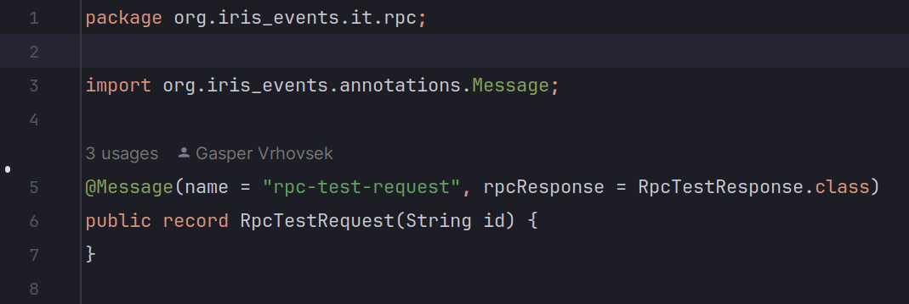
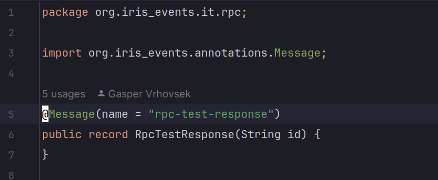
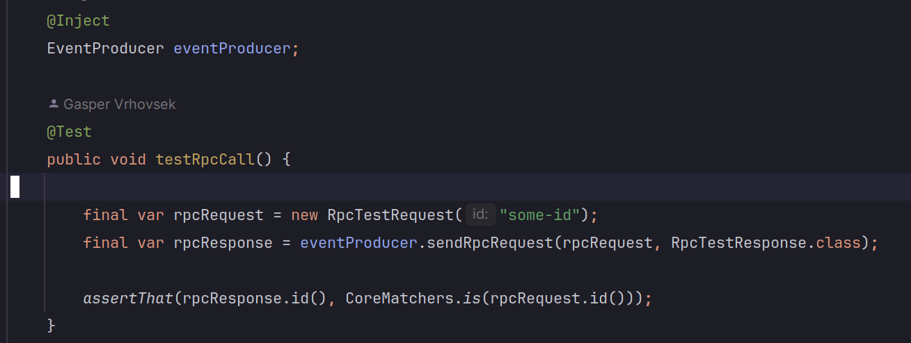

= [TD] Iris RPC

As of version 5.0.10 (tbd) Iris supports RPC (remote procedure call). The purpose of RPC is to call other processes/service like a local system. RPC on Iris is only enabled for inter-service communication, therefore can not be used by client applications.

== Glossary

* RPC - remote procedure call

* request - in context of Iris RPC api this is an event that poses as a request message/command

* response - in context of Iris RPC api this is an event that poses as a response message with data

== API usage

Usage of the RPC api is fairly straight forward. It basically has two requirements:

. Define “request” and “response” events.

.. Link those two by referencing the “response” event in the `@Message` annotation of the "request" event.

. call `EventProducer.sendRpcRequest()`

Example:

* RPC request message definition

* RPC response message definition

* EventProducer RPC call

== How it works

Most of the rabbit infrastructure for RPC calls is defined by the consumer side. It defines the following on RabbitMQ:

* request exchange

* response exchange

* request queue (binds it to the request exchange)

Then it starts consuming the request queue.

The only part left is for the response queue to be declared and bound to the response exchange. That is done lazily by the `EventProducer` when invoking the `sendRpcRequest` method. The `EventProducer` also correctly sets the `replyTo` parameter to the request event, so the consumer side knows where to emit the response.

== AsyncAPI changes

For this to work with generated models all RPC relevant info has to be communicated through the AsyncAPI definition. For this a new AsyncAPI header was introduced: `x-rpc-response-type`. With the help of this header correct values can be populated in the `@Message` annotation of the generated RPC models.